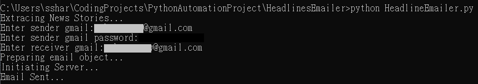
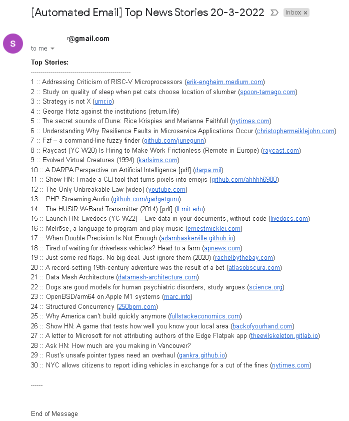

# Python Headeline Emailer
a python automatic email sender that sends scraped news headlines and url

# Tool & Libraries Used
Python, Python Requests, BeautifulSoup, email.mime

# Project Overview
- scraped the news source with http requests lib
- extract news component using beautiful soup and regex pattern matching
- constructed the email object with email.mime to include the headlines and the urls
- connected to gmail server and send the email with smtplib

# Project Demo
- can directly run the program in terminal by entering the sender gmail and password 
    - 
- email received
    - 

